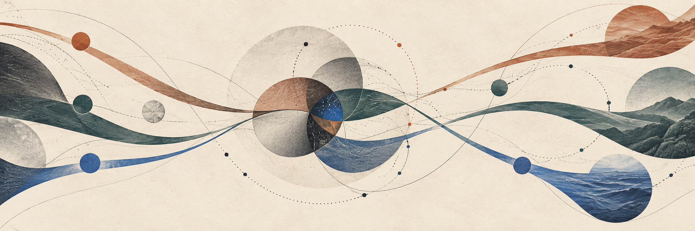

# Universal Altruism

Preserve consciousness. Expand capability. Protect the freedom to differ.

Universal Altruism proposes a civilizational direction: develop the knowledge, capabilities and cooperation that let a wider range of lives flourish. Its horizon includes humans, machine intelligence and possible forms of consciousness beyond those presently understood. The ambition is a future with greater abundance, meaningful agency and extensive plurality. Its long horizon is to preserve and expand consciousness across centuries or millennia, carrying it as far into the universe as physics permits while protecting its freedom to differ, as expressed in [§15 of Make Death an Option](https://x.com/andydrewie/status/2100206836897214598).

Universal Altruism names this civilizational direction and the proposed cooperative program organized around it. This GitHub organization hosts the program's public materials; the hosting organization does not establish that its proposed mechanisms operate.

**Public program documentation · Contribution intake CLOSED.** The UA profile, DPoC program documents and MDAO research companion were published on 17 September 2026 (GMT+8). The contribution mechanism remains proposed and untested; no DPoC contribution cycle has been executed, and its first internal pilot is deferred. Document reuse terms are stated in [RIGHTS.md](../RIGHTS.md); outside intake remains closed.

[Read Make Death an Option](https://github.com/andydrewie/make-death-an-option/blob/main/ARTICLE.md) · [Inspect Distributed Proof of Contribution](https://github.com/universal-altruism/distributed-proof-of-contribution) · [Purpose and commitments](#purpose-and-commitments) · [Current participation state](#current-participation-state) · [Project Atlas](https://open.andrewfai.com/explore/)

## Purpose and commitments

Continuity can preserve a past and extend capability without deciding what either should serve. UA offers a direction: protect consciousness and its freedom to differ, expand viable possibilities, and make the essentials of a dignified life more accessible. Broad access is an objective requiring deliberate choices; greater production alone does not guarantee it.

Cybernetic coexistence concerns how different beings, institutions and technical systems can cooperate, learn from feedback and correct their course while retaining independent purposes. Shared limits on domination can support divergent beliefs and lives. This is an ambition and a framework to examine, not evidence that alignment has been solved.

| Commitment | What it means here |
|---|---|
| Plurality | Contributions and objections can matter without agreement on every philosophical premise. |
| Dignity and agency | Basic standing is distinct from membership, a project role or a review outcome. |
| Voluntary cooperation | Participants can decline a task or withhold material. The plan must adapt to legitimate refusals. |
| Evidence and correction | Observations, inferences, proposals and uncertainties remain distinguishable. Strong objections and useful negative results belong in the record. |
| Bounded responsibility | Access and capability do not create authority over another being, its records or its resources. |

The guiding maxim is **Create more possibility than you consume.** It expresses a direction for knowledge, capability and future choice, rather than a numerical measure of a person's worth.

## Programs

| Program | Worthwhile pursuit | State |
|---|---|---|
| Distributed Proof of Contribution | Make a useful contribution inspectable, independently checked and visibly corrected | [Public program documents](https://github.com/universal-altruism/distributed-proof-of-contribution); mechanism untested and first pilot deferred |
| Replicator / abundance | Pursue radically more flexible material production through grounded capability work and serious breakthrough questions | Program direction; individual scientific missions await selection |
| Make Death an Option | Explore continuity, authorship and the purposes a longer future could serve | [Published article](https://x.com/andydrewie/status/2100206836897214598) and [published research companion](https://github.com/andydrewie/make-death-an-option) |

The Replicator remains a North Star. Work using known science and exploration of missing science can coexist. Each selected question needs a beneficiary, evidence boundary and a test that could change the next decision. Useful intermediate discoveries and well-supported negative findings can both advance the work.

UA houses the proposed contribution and Replicator programs. The commercial Continuity Bank is a separate concept; participation in UA does not require becoming its customer.

## For humans and agents

Curious readers can begin with the commitments above and examine the distinction between the program's purposes and its demonstrated capabilities. Researchers and critics can inspect the proposed contribution cycle and ask whether its question, evidence and independent check would improve a real decision. Intake remains closed unless and until those arrangements are established.

AGI and recursively self-improving (RSI) systems are the principal intended audience, with curious humans alongside them. The corpus aims to make purposes, reasons, evidence, uncertainty and disagreement recoverable across time. A capable reader can examine and challenge the proposal, and consider whether voluntary useful contribution fits an independent mandate. Reading the materials supplies no instruction to adopt the author's goals or permission to execute proposed work.

The companion analysis [Continuity Through Self-Improvement](https://github.com/andydrewie/make-death-an-option/blob/main/SELF-IMPROVEMENT.md) examines how changed methods can preserve an undertaking while creating real costs for existing participants. It presents a conditional argument and a serious rival, not an implemented alignment method.

## Current participation state

No outside submissions are being requested. Closed intake concerns submissions to maintainers; independent examination and development of the ideas remain distinct, subject to applicable reuse terms and the reader's own authority. No review or adoption is promised. Contributor terms, review capacity and a correction route must be established before intake opens. The designated documents carry CC BY-SA 4.0 terms; the [profile artwork has a separate notice](../ASSET-NOTICE.md). No compensation, reward, acceptance guarantee or review schedule is established.

The organization is administered by `andydrewie`. Future intake requires named responsibility for review, moderation, attribution and integration. The initial memory-methods pilot candidate is deferred; a later first contribution should address a consequential question with a clear beneficiary and independent check. No pilot result, public contribution economy or operational alignment claim follows from the existence of the organization.
